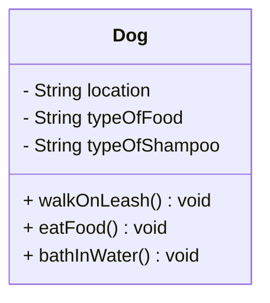

# PawPal+ Project Reflection

## 1. System Design
Three Core Actions to peform:
Walk a Pet, Feed a pet, Bath a Pet
**a. Initial design**

- Briefly describe your initial UML design.

For my UML design I did such as walking the pet, feeding the pet, and bathing the pet. These three core functions are important and are vaulable to the UML design overall.

- What classes did you include, and what responsibilities did you assign to each?
 I assigned walking the pet as a public class, feeding the pet and bathing the pet as private classes. These responsibility such as feeding the pet is assigning the pet to be fed by the owner, the walking that the pet is walked by the owner, and that the bathing is that the pet is bathed by the owner. All three have priority assignments as they are the basic core function in keeping an animal healthy.

 Step 2: List Building Blocks(Attributes):
 1.Walking: Location
 2.Feeding: Type of Food
 3.Bathing: Type of Shampoo
 (Methods)
 1.Dog on Leash
 2. Eating Food
 3. Bath in Water



**b. Design changes**

- Did your design change during implementation?
Yes, there has been several changes!

-No Owner Class
-No Task Class
-Attributes written once with no getters/setters
-Methods have no parameters
-No Scheduling or Priority logic

- If yes, describe at least one change and why you made it.
The change I made was to have the Owner class available. Right now the dog class has its own care methods, but is a design miscmatch. An owner should hold reference to a Dog and call those methods.
---

## 2. Scheduling Logic and Tradeoffs

**a. Constraints and priorities**

- What constraints does your scheduler consider (for example: time, priority, preferences)?

The scheduler considers three main constraints:

1. **Time** — every task has a scheduled start time in `HH:MM` format. The `prioritize_tasks()` method sorts all pending tasks by time using `datetime.strptime`, ensuring the day's plan is ordered chronologically.
2. **Completion status** — a task is only included in the active schedule if it has not been marked complete (`is_due()` returns `False` for finished tasks). This prevents already-done work from cluttering the schedule.
3. **Recurrence/frequency** — tasks carry a `frequency` field (`Daily`, `Weekly`, `Monthly`) and a `due_date`. A task only appears on a given day if its `due_date` is today or earlier, so weekly and monthly tasks are automatically suppressed on days they aren't needed.

- How did you decide which constraints mattered most?

**Time was prioritized first** because a pet care schedule is inherently time-ordered — a dog needs to be walked before it eats breakfast, not after. Without correct ordering, the schedule is unusable regardless of anything else.

**Completion status was second** because showing already-finished tasks as pending would mislead the owner and break the recurring task system — a completed daily task needs to be retired so its next occurrence can take its place.

**Frequency/recurrence was third** because it makes the scheduler practical for real daily use. Without it, every task would appear every single day whether it was due or not, which would require the owner to manually track weekly baths and monthly vet checkups themselves — defeating the purpose of the app.

**b. Tradeoffs**

- Describe one tradeoff your scheduler makes.

The `detect_conflicts()` method flags two tasks as a conflict only when they share an **exact start time** (e.g., both at `"8:00"`). It does not account for task duration — a 30-minute walk starting at `7:00` and a 10-minute feeding at `7:20` would not be flagged, even though they genuinely overlap.

Copilot suggested collapsing `Owner.get_all_tasks()` from an explicit nested `for` loop into a single nested list comprehension:

```python
# Copilot's Pythonic suggestion
return [(pet.name, task) for pet in self.pets for task in pet.get_tasks()]
```

 The nested comprehension is harder to read for anyone learning the codebase, and clarity was prioritized over brevity here.

- Why is that tradeoff reasonable for this scenario?

Exact-time conflict detection is a reasonable starting point because tasks in PawPal+ are currently defined by a start time only — there is no `duration_minutes` field on `Task`. Adding duration-aware overlap detection would require a more complex interval comparison (`start_A < end_B and start_B < end_A`) and a new required field on every task. For a pet care scheduler where most tasks are short and spaced apart, exact-time matching catches the most obvious scheduling errors without overcomplicating the model.

---

## 3. AI Collaboration

**a. How you used AI**

- How did you use AI tools during this project (for example: design brainstorming, debugging, refactoring)?

AI was used throughout every phase of this project. During design, it helped identify missing classes (Owner, Task, Scheduler) that were not in the original UML sketch. During implementation, it generated method stubs, wrote docstrings, and suggested how `datetime.strptime` and `timedelta` could be used for robust time sorting and recurring task scheduling. During testing, it drafted the full 13-test pytest suite covering each class independently. During refactoring, it reviewed `detect_conflicts()` and `get_all_tasks()` and proposed a nested list comprehension as a simplification.

- What kinds of prompts or questions were most helpful?

The most helpful prompts were specific and tied to a concrete file or method — for example, "Based on my skeletons in pawpal_system.py, how should the Scheduler retrieve all tasks from the Owner's pets?" and "How could this algorithm be simplified for better readability or performance?" Broad questions like "help me build a scheduler" were less useful than targeted ones about a single method or behavior.

**b. Judgment and verification**

- Describe one moment where you did not accept an AI suggestion as-is.

When asked to simplify `Owner.get_all_tasks()`, AI suggested replacing the explicit nested `for` loop with a single nested list comprehension. The suggestion was syntactically correct and more concise, but harder to follow for someone reading the code for the first time.

- How did you evaluate or verify what the AI suggested?

The suggestion was tested by reading it aloud and tracing the data flow manually. The nested comprehension (`for pet in self.pets for task in pet.get_tasks()`) hides the two-level traversal in a way that the loop makes obvious. Since clarity was the priority, the original loop was kept and the decision was documented in the tradeoffs section.

---

## 4. Testing and Verification

**a. What you tested**

- What behaviors did you test?

13 unit tests were written across all four classes using pytest:

- `Task`: default completion status, `mark_complete()`, `is_due()` before and after completion
- `Pet`: starts with an empty task list, `add_task()` for one and multiple tasks
- `Owner`: starts with no pets, `add_pet()`, `get_all_tasks()` across multiple pets
- `Scheduler`: retrieves all tasks, filters out completed tasks, sorts pending tasks by time

- Why were these tests important?

Each method in `pawpal_system.py` builds on the one below it — `Scheduler` depends on `Owner`, which depends on `Pet`, which depends on `Task`. Testing each layer independently made it possible to trust that sorting and filtering bugs were in the `Scheduler`, not hiding in `Pet.add_task()` or `Task.is_due()`.

**b. Confidence**

- How confident are you that your scheduler works correctly?

Confident for the core happy path: adding tasks, sorting by time, filtering by pet or status, marking complete, and auto-scheduling recurrences. All 13 tests pass and `main.py` produces correct output including conflict warnings.

- What edge cases would you test next if you had more time?

1. A pet with no tasks — does `filter_by_pet()` return an empty list cleanly?
2. Two tasks at the same time for the same pet (not just different pets)
3. A `due_date` set in the past — does `is_due()` still return `True`?
4. Marking a task complete when its frequency is not in `RECURRENCE_DAYS` — does `mark_task_complete()` handle an unknown frequency gracefully?
5. An owner with no pets — does `Scheduler.run()` print "No pending tasks" without crashing?

---

## 5. Reflection

**a. What went well**

- What part of this project are you most satisfied with?

The `Scheduler.mark_task_complete()` method is the most satisfying piece. It ties together three separate concepts — marking a task done, calculating the next due date with `timedelta`, and adding a new `Task` instance back to the correct `Pet` — in a way that feels like a real system behavior rather than a demo stub. Seeing the auto-created next occurrence appear in `main.py` output with the correct future date made the scheduler feel genuinely useful.

**b. What you would improve**

- If you had another iteration, what would you improve or redesign?

The conflict detection would be the first thing to improve. The current implementation only catches exact time collisions. Adding a `duration_minutes` field to `Task` would allow interval-based overlap checking (`start_A < end_B and start_B < end_A`), which would catch cases like a 45-minute walk at 7:00 conflicting with a feeding at 7:30. The Streamlit UI (`app.py`) would also benefit from a "Mark Complete" button wired to `Scheduler.mark_task_complete()` so the recurrence logic is actually exercised through the interface.

**c. Key takeaway**

- What is one important thing you learned about designing systems or working with AI on this project?

AI is most useful as a reviewer and an accelerator, not as an architect. It generated correct code quickly — stubs, tests, docstrings, sorting logic — but it could not know which design decisions mattered for this specific project without context. The decision to keep the explicit loop over the list comprehension, and to use exact-time rather than duration-based conflict detection, were both human judgment calls made after reviewing what AI suggested. The takeaway is that AI proposals should always be read critically: ask whether the suggestion is optimizing for the right thing (correctness, readability, performance) before accepting it.
