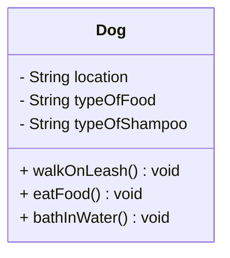

# PawPal+ Project Reflection

## 1. System Design
Three Core Actions to peform:
Walk a Pet, Feed a pet, Bath a Pet
**a. Initial design**

- Briefly describe your initial UML design.

For my UML design I did such as walking the pet, feeding the pet, and bathing the pet. These three core functions are important and are vaulable to the UML design overall.

- What classes did you include, and what responsibilities did you assign to each?
 I assigned walking the pet as a public class, feeding the pet and bathing the pet as private classes. These responsibility such as feeding the pet is assigning the pet to be fed by the owner, the walking that the pet is walked by the owner, and that the bathing is that the pet is bathed by the owner. All three have priority assignments as they are the basic core function in keeping an animal healthy.

 Step 2: List Building Blocks(Attributes):
 1.Walking: Location
 2.Feeding: Type of Food
 3.Bathing: Type of Shampoo
 (Methods)
 1.Dog on Leash
 2. Eating Food
 3. Bath in Water

**b. Design changes**

- Did your design change during implementation?
Yes, there has been several changes!

-No Owner Class
-No Task Class
-Attributes written once with no getters/setters
-Methods have no parameters
-No Scheduling or Priority logic

- If yes, describe at least one change and why you made it.
The change I made was to have the Owner clas available. Right now the dog class has its own care methods, but is a design miscmatch. An owner should hold reference to a Dog and call those methods.
---

## 2. Scheduling Logic and Tradeoffs

**a. Constraints and priorities**

- What constraints does your scheduler consider (for example: time, priority, preferences)?
- How did you decide which constraints mattered most?

**b. Tradeoffs**

- Describe one tradeoff your scheduler makes.
- Why is that tradeoff reasonable for this scenario?

---

## 3. AI Collaboration

**a. How you used AI**

- How did you use AI tools during this project (for example: design brainstorming, debugging, refactoring)?
- What kinds of prompts or questions were most helpful?

**b. Judgment and verification**

- Describe one moment where you did not accept an AI suggestion as-is.
- How did you evaluate or verify what the AI suggested?

---

## 4. Testing and Verification

**a. What you tested**

- What behaviors did you test?
- Why were these tests important?

**b. Confidence**

- How confident are you that your scheduler works correctly?
- What edge cases would you test next if you had more time?

---

## 5. Reflection

**a. What went well**

- What part of this project are you most satisfied with?

**b. What you would improve**

- If you had another iteration, what would you improve or redesign?

**c. Key takeaway**

- What is one important thing you learned about designing systems or working with AI on this project?
